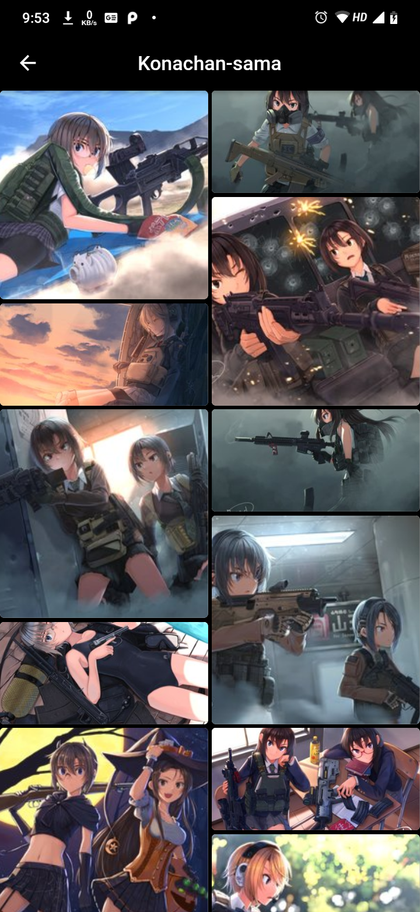

# Konachan - Sama

An app written in flutter to utilize the [Konachan API](https://konachan.com/)
.
It's purely for the purpose to practice the concepts of flutter and follow the best conventions possible. It also serves as a sandbox for me to try out various good practices.

### WARNING:
    Compile at your own risk as the API also provides some explicit imagery.
    I will not be held responsible for any kind of `bad` experience you may 
    be presented with. PROCEED WITH CAUTION